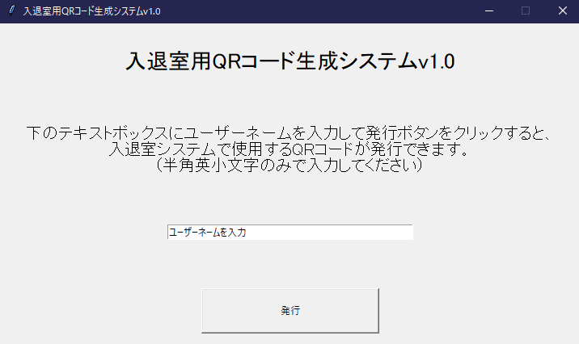

# qrcode_generator

## 概要
名古屋大学写真部の部室入退室システムで使用するQRコードを生成するプログラムです。
（現在は使用していません。）

## 使い方

### QRコード生成画面

ユーザーネーム入力欄に自分の使いたいユーザー名を入力し発行をクリックすると、
`qrcode/(自分のユーザー名)`フォルダにそのユーザーの入退室システム用QRコードが生成されます。
既に使用されているユーザーネームは使えません。
もしQRコードを紛失した場合は、新しいユーザーとして再登録するか、管理者（Admin）まで報告してください。

### QRコード

上2枚のQRコードが発行されます。赤色のQRコードが入室用、青色のQRコードが退室用です。
入室する際は赤色のQRコードを、退室する際は青色のQRコードをカメラにかざしてください。

### Admin向け情報

登録者リストは`id.csv`で管理されます。（これ以外のファイル名は認められません。）
ユーザーがQRコードを紛失し、再度同じユーザー名でQRコードを再発行したい場合、
このcsvファイルから当該ユーザーを削除してください。
同じユーザー名で再登録することができます。（ID及びQRコードは新規のものとなります。）

### 更新情報

2020/10/19：v1.0リリース。ユーザー用QRコードと登録者リストの生成。
